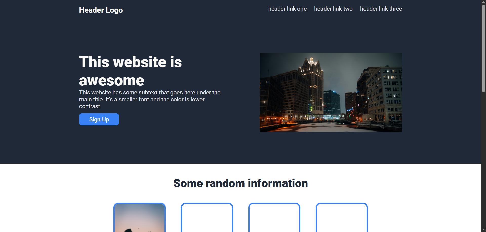

# Landing Page Project

A simple landing page built with HTML/CSS for [The Odin Project](https://www.theodinproject.com/) Foundations course.



➡ **Live Demo**: [https://wrzdx.github.io/landing-page/](https://wrzdx.github.io/landing-page/)

## Project Overview
- **Objective**: Practice CSS Flexbox layout techniques
- **Key Features**:
  - Hero section with call-to-action
  - Content information sections
  - Styled footer

## Technologies & Skills
🛠 **Built With**:
- Semantic HTML5
- CSS3 (Flexbox)
- Git version control

🎯 **Learning Outcomes**:
✅ Mastered CSS Flexbox layout  


## Image Credits
| Image | Source | Photographer |
|-------|--------|--------------|
| Night City | [Unsplash](https://unsplash.com/photos/a-view-of-a-city-at-night-from-across-the-street-zl4YgnCMg-w) | Chris Lynch |
| Sunset View | [Unsplash](https://unsplash.com/photos/two-people-watch-the-sunset-over-rome-0bArovre6cQ) | Cheng Lin |

## Setup Instructions
1. Clone repository:
   ```bash
   git clone https://github.com/wrzdx/landing-page.git
2. Open `index.html` in your browser